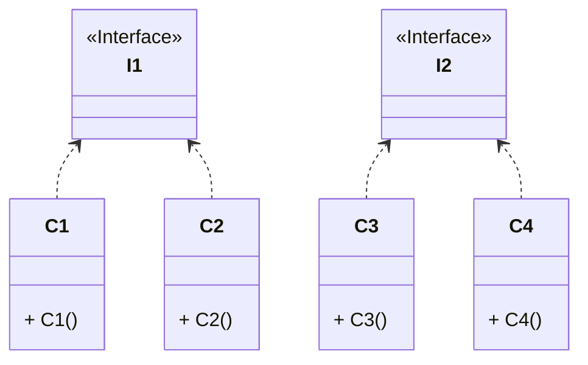

# Spring Core Util

## comparator

### BooleanComparator

Boolean对象的Comparator，可以首先对true或false进行排序。

```java
// Boolean对象的Comparator，可以首先对true或false进行排序，构造参数为true，说明true是最小的。
Comparator<Boolean> c = new BooleanComparator(true);
// true是最小的，c.compare(true, false)为-1，c.compare(false, true)为1
assertThat(c.compare(true, false)).isEqualTo(-1);
assertThat(c.compare(Boolean.TRUE, Boolean.TRUE)).isEqualTo(0);
```

```java
// true为最大的
Comparator<Boolean> c = new BooleanComparator(false);
// 最大的跟最小的比较为1。
assertThat(c.compare(true, false)).isEqualTo(1);
assertThat(c.compare(Boolean.TRUE, Boolean.TRUE)).isEqualTo(0);
```

```java
// 通过静态方式
Comparator<Boolean> c = BooleanComparator.TRUE_LOW;
assertThat(c.compare(true, false)).isEqualTo(-1);
assertThat(c.compare(Boolean.TRUE, Boolean.TRUE)).isEqualTo(0);
```

```java
// 以此类推
Comparator<Boolean> c = BooleanComparator.TRUE_HIGH;
assertThat(c.compare(true, false)).isEqualTo(1);
assertThat(c.compare(Boolean.TRUE, Boolean.TRUE)).isEqualTo(0);
```

### ComparableComparator

使Comparables适应Comparator接口的比较器。主要供其他比较器内部使用，当应该在可比较对象上工作时。

```java
Comparator<String> c = new ComparableComparator<>();
String s1 = "abc";
String s2 = "cde";
// 其实这里还是用的String的 o1.compareTo(o2)
assertThat(c.compare(s1, s2)).isLessThan(0);
```

```java
Comparator c = new ComparableComparator();
Object o1 = new Object();
Object o2 = new Object();
// 这样会报转换异常class java.lang.Object cannot be cast to class java.lang.Comparable
assertThatExceptionOfType(ClassCastException.class).isThrownBy(() ->
        c.compare(o1, o2));
```

### InstanceComparator

比较对象时应使用的类的有序列表。列表中较早的班级将获得更高的优先级。



```java
private C1 c1 = new C1();
private C2 c2 = new C2();
private C3 c3 = new C3();
private C4 c4 = new C4();
```

```java
//核心主要是维持一下Clsas[]数组，比较对象属于哪个Class,获取索引在比较。
Comparator<Object> comparator = new InstanceComparator<>(C1.class, C2.class);
assertThat(comparator.compare(c1, c1)).isEqualTo(0);
assertThat(comparator.compare(c1, c2)).isEqualTo(-1);
assertThat(comparator.compare(c2, c1)).isEqualTo(1);
assertThat(comparator.compare(c2, c3)).isEqualTo(-1);
assertThat(comparator.compare(c2, c4)).isEqualTo(-1);
assertThat(comparator.compare(c3, c4)).isEqualTo(0);
```

```java
Comparator<Object> comparator = new InstanceComparator<>(I1.class, I2.class);
assertThat(comparator.compare(c1, c1)).isEqualTo(0);
assertThat(comparator.compare(c1, c2)).isEqualTo(0);
assertThat(comparator.compare(c2, c1)).isEqualTo(0);
assertThat(comparator.compare(c1, c3)).isEqualTo(-1);
assertThat(comparator.compare(c3, c1)).isEqualTo(1);
assertThat(comparator.compare(c3, c4)).isEqualTo(0);
```

```java
Comparator<Object> comparator = new InstanceComparator<>(I1.class, C3.class);
assertThat(comparator.compare(c1, c1)).isEqualTo(0);
assertThat(comparator.compare(c3, c4)).isEqualTo(-1);
assertThat(comparator.compare(c3, null)).isEqualTo(-1);
assertThat(comparator.compare(c4, null)).isEqualTo(0);
```


### NullSafeComparator

一个比较器，可以安全地比较空值是否低于或高于其他对象。可以装饰给定的比较器或处理可比对象。

```java
//如果为null则是低优先级
Comparator<String> c = NullSafeComparator.NULLS_LOW;
assertThat(c.compare(null, "boo")).isLessThan(0);
```

```java
//如果为null则是高优先级
Comparator<String> c = NullSafeComparator.NULLS_HIGH;
assertThat(c.compare(null, "boo")).isGreaterThan(0);
assertThat(c.compare(null, null)).isEqualTo(0);
```

