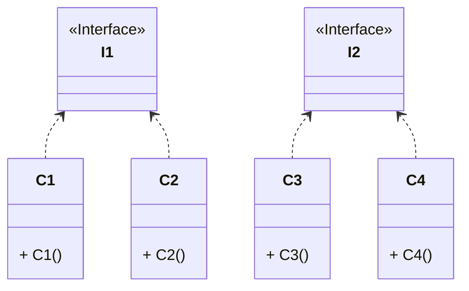

# Spring Core Util

[SpringUtil](https://github.com/spring-projects/spring-framework/tree/main/spring-core/src/test/java/org/springframework/util)


## comparator

比较器

### BooleanComparator

Boolean对象的Comparator，可以首先对true或false进行排序。

```java
// Boolean对象的Comparator，可以首先对true或false进行排序，构造参数为true，说明true是最小的。
Comparator<Boolean> c = new BooleanComparator(true);
// true是最小的，c.compare(true, false)为-1，c.compare(false, true)为1
assertThat(c.compare(true, false)).isEqualTo(-1);
assertThat(c.compare(Boolean.TRUE, Boolean.TRUE)).isEqualTo(0);
```

```java
// true为最大的
Comparator<Boolean> c = new BooleanComparator(false);
// 最大的跟最小的比较为1。
assertThat(c.compare(true, false)).isEqualTo(1);
assertThat(c.compare(Boolean.TRUE, Boolean.TRUE)).isEqualTo(0);
```

```java
// 通过静态方式
Comparator<Boolean> c = BooleanComparator.TRUE_LOW;
assertThat(c.compare(true, false)).isEqualTo(-1);
assertThat(c.compare(Boolean.TRUE, Boolean.TRUE)).isEqualTo(0);
```

```java
// 以此类推
Comparator<Boolean> c = BooleanComparator.TRUE_HIGH;
assertThat(c.compare(true, false)).isEqualTo(1);
assertThat(c.compare(Boolean.TRUE, Boolean.TRUE)).isEqualTo(0);
```

### ComparableComparator

使Comparables适应Comparator接口的比较器。主要供其他比较器内部使用，当应该在可比较对象上工作时。

```java
Comparator<String> c = new ComparableComparator<>();
String s1 = "abc";
String s2 = "cde";
// 其实这里还是用的String的 o1.compareTo(o2)
assertThat(c.compare(s1, s2)).isLessThan(0);
```

```java
Comparator c = new ComparableComparator();
Object o1 = new Object();
Object o2 = new Object();
// 这样会报转换异常class java.lang.Object cannot be cast to class java.lang.Comparable
assertThatExceptionOfType(ClassCastException.class).isThrownBy(() ->
        c.compare(o1, o2));
```

### InstanceComparator

比较对象时应使用的类的有序列表。列表中较早的班级将获得更高的优先级。



```java
private C1 c1 = new C1();
private C2 c2 = new C2();
private C3 c3 = new C3();
private C4 c4 = new C4();
```

```java
//核心主要是维持一下Clsas[]数组，比较对象属于哪个Class,获取索引在比较。
Comparator<Object> comparator = new InstanceComparator<>(C1.class, C2.class);
assertThat(comparator.compare(c1, c1)).isEqualTo(0);
assertThat(comparator.compare(c1, c2)).isEqualTo(-1);
assertThat(comparator.compare(c2, c1)).isEqualTo(1);
assertThat(comparator.compare(c2, c3)).isEqualTo(-1);
assertThat(comparator.compare(c2, c4)).isEqualTo(-1);
assertThat(comparator.compare(c3, c4)).isEqualTo(0);
```

```java
Comparator<Object> comparator = new InstanceComparator<>(I1.class, I2.class);
assertThat(comparator.compare(c1, c1)).isEqualTo(0);
assertThat(comparator.compare(c1, c2)).isEqualTo(0);
assertThat(comparator.compare(c2, c1)).isEqualTo(0);
assertThat(comparator.compare(c1, c3)).isEqualTo(-1);
assertThat(comparator.compare(c3, c1)).isEqualTo(1);
assertThat(comparator.compare(c3, c4)).isEqualTo(0);
```

```java
Comparator<Object> comparator = new InstanceComparator<>(I1.class, C3.class);
assertThat(comparator.compare(c1, c1)).isEqualTo(0);
assertThat(comparator.compare(c3, c4)).isEqualTo(-1);
assertThat(comparator.compare(c3, null)).isEqualTo(-1);
assertThat(comparator.compare(c4, null)).isEqualTo(0);
```


### NullSafeComparator

一个比较器，可以安全地比较空值是否低于或高于其他对象。可以装饰给定的比较器或处理可比对象。

```java
//如果为null则是低优先级
Comparator<String> c = NullSafeComparator.NULLS_LOW;
assertThat(c.compare(null, "boo")).isLessThan(0);
```

```java
//如果为null则是高优先级
Comparator<String> c = NullSafeComparator.NULLS_HIGH;
assertThat(c.compare(null, "boo")).isGreaterThan(0);
assertThat(c.compare(null, null)).isEqualTo(0);
```


## concurrent


### FutureAdapter(过时)

### FutureUtils

```java
String foo = "Foo";
//创建一个异步作业
CompletableFuture<String> future = FutureUtils.callAsync(() -> foo);

//阻塞获取结果
assertThat(future.get()).isEqualTo(foo);
assertThat(future.isCancelled()).isFalse();
assertThat(future.isDone()).isTrue();

CountDownLatch latch = new CountDownLatch(1);
future.whenComplete((s, throwable) -> {
    assertThat(s).isEqualTo(foo);
    assertThat(throwable).isNull();
    latch.countDown();
});
latch.await();
```

```java
  RuntimeException ex = new RuntimeException("Foo");
  CompletableFuture<String> future = FutureUtils.callAsync(() -> {
      throw ex;
  });
  assertThatExceptionOfType(ExecutionException.class)
          .isThrownBy(future::get)
          .withCause(ex);
  assertThat(future.isCancelled()).isFalse();
  assertThat(future.isDone()).isTrue();

  CountDownLatch latch = new CountDownLatch(1);
  future.whenComplete((s, throwable) -> {
      assertThat(s).isNull();
      assertThat(throwable).isInstanceOf(CompletionException.class)
              .hasCause(ex);
      latch.countDown();
  });
  latch.await();
```

### ListenableFuture(过时)

### MonoToListenableFutureAdapter(过时)

### SettableListenableFuture(过时)


## function

### ThrowingBiFunction

允许调用引发已检查异常的代码的BiFunction 

```java
//将非RuntimeException异常包装成指定异常，默认包装成RuntimeException
ThrowingBiFunction<Object, Object, Object> function = this::throwIllegalArgumentException;
assertThatIllegalArgumentException().isThrownBy(() -> function.apply(this, this));
```

### ThrowingConsumer


### ThrowingFunction


### ThrowingSupplier

```java
ThrowingSupplier<Object> supplier = this::throwIllegalArgumentException;
assertThatIllegalArgumentException().isThrownBy(supplier::get);

//default T get(BiFunction<String, Exception, RuntimeException> exceptionWrapper) {
//	try {
//    获取实际的调用方法
//		return getWithException();
//	}
//	catch (RuntimeException ex) {
//		throw ex;
//	}
//	catch (Exception ex) {
//    //封装异常
//		throw exceptionWrapper.apply(ex.getMessage(), ex);
//	}
//}
```


## unit

### DataSize

```java
//数据单位：B、KB、MB、GB、TB
//B转B
assertThat(DataSize.ofBytes(1024).toBytes()).isEqualTo(1024);

//B转KB
assertThat(DataSize.ofBytes(1024).toKilobytes()).isEqualTo(1);

//KB转KB
assertThat(DataSize.ofKilobytes(1024).toKilobytes()).isEqualTo(1024);

//KB转MB
assertThat(DataSize.ofKilobytes(1024).toMegabytes()).isEqualTo(1);

//MB转MB
assertThat(DataSize.ofMegabytes(1024).toMegabytes()).isEqualTo(1024);

//MB转GB
assertThat(DataSize.ofMegabytes(2048).toGigabytes()).isEqualTo(2);

//GB转GB
assertThat(DataSize.ofGigabytes(4096).toGigabytes()).isEqualTo(4096);

//GB转TB
assertThat(DataSize.ofGigabytes(4096).toTerabytes()).isEqualTo(4);

//TB转GB
assertThat(DataSize.ofTerabytes(1).toGigabytes()).isEqualTo(1024);

//10B比较
assertThat(DataSize.of(10, DataUnit.BYTES)).isEqualTo(DataSize.ofBytes(10));

//1024B转KB
assertThat(DataSize.parse("1024")).isEqualTo(DataSize.ofKilobytes(1));

//1GB比较1024MB
assertThat(DataSize.parse("1GB")).isEqualTo(DataSize.ofMegabytes(1024));
```


## xml

不常用暂时不讲


## AntPathMatcher

> Ant 风格路径模式的PathMatcher实现。
> 此映射代码的一部分是从Apache Ant 借用的。
> 映射使用以下规则匹配 URL： 
> ?匹配一个字符
> *匹配零个或多个字符
> **匹配路径中的零个或多个目录
> {spring:[az]+}匹配正则表达式[az]+作为名为“spring”的路径变量
>
> 例子
> com/t?st.jsp — 匹配com/test.jsp但也匹配com/tast.jsp或com/txst.jsp
> com/*.jsp — 匹配com目录中的所有.jsp文件
> com/**/test.jsp — 匹配com路径下的所有test.jsp文件
> org/springframework/**/*.jsp — 匹配org/springframework路径下的所有.jsp文件
> org/**/servlet/bla.jsp — 匹配org/springframework/servlet/bla.jsp但也org/springframework/testing/servlet/bla.jsp和org/servlet/bla.jsp
> com/{filename:\\w+}.jsp将匹配com/test.jsp并将值test分配给filename变量
> 注意：模式和路径必须都是绝对的或必须都是相对的才能使两者匹配。因此，建议此实现的用户清理模式，以便在它们前面加上“/”前缀，因为这在使用它们的上下文中有意义

[详情](https://github.com/spring-projects/spring-framework/blob/main/spring-core/src/test/java/org/springframework/util/AntPathMatcherTests.java)

```java
// test exact matching
assertThat(pathMatcher.match("test", "test")).isTrue();
assertThat(pathMatcher.match("/test", "/test")).isTrue();
// SPR-14141
assertThat(pathMatcher.match("https://example.org", "https://example.org")).isTrue();
assertThat(pathMatcher.match("/test.jpg", "test.jpg")).isFalse();
assertThat(pathMatcher.match("test", "/test")).isFalse();
assertThat(pathMatcher.match("/test", "test")).isFalse();

// test matching with ?'s
assertThat(pathMatcher.match("t?st", "test")).isTrue();
assertThat(pathMatcher.match("??st", "test")).isTrue();
assertThat(pathMatcher.match("tes?", "test")).isTrue();
assertThat(pathMatcher.match("te??", "test")).isTrue();
assertThat(pathMatcher.match("?es?", "test")).isTrue();
assertThat(pathMatcher.match("tes?", "tes")).isFalse();
assertThat(pathMatcher.match("tes?", "testt")).isFalse();
assertThat(pathMatcher.match("tes?", "tsst")).isFalse();

// test matching with *'s
assertThat(pathMatcher.match("*", "test")).isTrue();
assertThat(pathMatcher.match("test*", "test")).isTrue();
assertThat(pathMatcher.match("test*", "testTest")).isTrue();
assertThat(pathMatcher.match("test/*", "test/Test")).isTrue();
assertThat(pathMatcher.match("test/*", "test/t")).isTrue();
assertThat(pathMatcher.match("test/*", "test/")).isTrue();
assertThat(pathMatcher.match("*test*", "AnothertestTest")).isTrue();
assertThat(pathMatcher.match("*test", "Anothertest")).isTrue();
assertThat(pathMatcher.match("*.*", "test.")).isTrue();
assertThat(pathMatcher.match("*.*", "test.test")).isTrue();
assertThat(pathMatcher.match("*.*", "test.test.test")).isTrue();
assertThat(pathMatcher.match("test*aaa", "testblaaaa")).isTrue();
assertThat(pathMatcher.match("test*", "tst")).isFalse();
assertThat(pathMatcher.match("test*", "tsttest")).isFalse();
assertThat(pathMatcher.match("test*", "test/")).isFalse();
assertThat(pathMatcher.match("test*", "test/t")).isFalse();
assertThat(pathMatcher.match("test/*", "test")).isFalse();
assertThat(pathMatcher.match("*test*", "tsttst")).isFalse();
assertThat(pathMatcher.match("*test", "tsttst")).isFalse();
assertThat(pathMatcher.match("*.*", "tsttst")).isFalse();
assertThat(pathMatcher.match("test*aaa", "test")).isFalse();
assertThat(pathMatcher.match("test*aaa", "testblaaab")).isFalse();

// test matching with ?'s and /'s
assertThat(pathMatcher.match("/?", "/a")).isTrue();
assertThat(pathMatcher.match("/?/a", "/a/a")).isTrue();
assertThat(pathMatcher.match("/a/?", "/a/b")).isTrue();
assertThat(pathMatcher.match("/??/a", "/aa/a")).isTrue();
assertThat(pathMatcher.match("/a/??", "/a/bb")).isTrue();
assertThat(pathMatcher.match("/?", "/a")).isTrue();

// test matching with **'s
assertThat(pathMatcher.match("/**", "/testing/testing")).isTrue();
assertThat(pathMatcher.match("/*/**", "/testing/testing")).isTrue();
assertThat(pathMatcher.match("/**/*", "/testing/testing")).isTrue();
assertThat(pathMatcher.match("/bla/**/bla", "/bla/testing/testing/bla")).isTrue();
assertThat(pathMatcher.match("/bla/**/bla", "/bla/testing/testing/bla/bla")).isTrue();
assertThat(pathMatcher.match("/**/test", "/bla/bla/test")).isTrue();
assertThat(pathMatcher.match("/bla/**/**/bla", "/bla/bla/bla/bla/bla/bla")).isTrue();
assertThat(pathMatcher.match("/bla*bla/test", "/blaXXXbla/test")).isTrue();
assertThat(pathMatcher.match("/*bla/test", "/XXXbla/test")).isTrue();
assertThat(pathMatcher.match("/bla*bla/test", "/blaXXXbl/test")).isFalse();
assertThat(pathMatcher.match("/*bla/test", "XXXblab/test")).isFalse();
assertThat(pathMatcher.match("/*bla/test", "XXXbl/test")).isFalse();

assertThat(pathMatcher.match("/????", "/bala/bla")).isFalse();
assertThat(pathMatcher.match("/**/*bla", "/bla/bla/bla/bbb")).isFalse();

assertThat(pathMatcher.match("/*bla*/**/bla/**", "/XXXblaXXXX/testing/testing/bla/testing/testing/")).isTrue();
assertThat(pathMatcher.match("/*bla*/**/bla/*", "/XXXblaXXXX/testing/testing/bla/testing")).isTrue();
assertThat(pathMatcher.match("/*bla*/**/bla/**", "/XXXblaXXXX/testing/testing/bla/testing/testing")).isTrue();
assertThat(pathMatcher.match("/*bla*/**/bla/**", "/XXXblaXXXX/testing/testing/bla/testing/testing.jpg")).isTrue();

assertThat(pathMatcher.match("*bla*/**/bla/**", "XXXblaXXXX/testing/testing/bla/testing/testing/")).isTrue();
assertThat(pathMatcher.match("*bla*/**/bla/*", "XXXblaXXXX/testing/testing/bla/testing")).isTrue();
assertThat(pathMatcher.match("*bla*/**/bla/**", "XXXblaXXXX/testing/testing/bla/testing/testing")).isTrue();
assertThat(pathMatcher.match("*bla*/**/bla/*", "XXXblaXXXX/testing/testing/bla/testing/testing")).isFalse();

assertThat(pathMatcher.match("/x/x/**/bla", "/x/x/x/")).isFalse();

assertThat(pathMatcher.match("/foo/bar/**", "/foo/bar")).isTrue();

assertThat(pathMatcher.match("", "")).isTrue();

assertThat(pathMatcher.match("/{bla}.*", "/testing.html")).isTrue();
assertThat(pathMatcher.match("/{bla}", "//x\ny")).isTrue();
assertThat(pathMatcher.match("/{var:.*}", "/x\ny")).isTrue();
```

## Assert

> 帮助验证参数的断言实用程序类。
> 对于在运行时尽早且清楚地识别程序员错误很有用。
> 例如，如果公共方法的约定不允许null参数，则可以使用Assert来验证该约定。这样做可以清楚地表明合同违规发生，并保护类的不变量。
> 通常用于验证方法参数而不是配置属性，以检查通常是程序员错误而不是配置错误的情况。与配置初始化代码相比，在此类方法中回退到默认值通常没有意义。
>
> 该类类似于 JUnit 的断言库。如果参数值被视为无效，则会抛出IllegalArgumentException （通常）。例如：
>   Assert.notNull(clazz, "The class must not be null");
>   Assert.isTrue(i > 0, "The value must be greater than zero");
> 主要供框架内部使用；对于更全面的断言实用程序套件，请考虑来自Apache Commons Lang  、Google Guava 的Preconditions 或类似第三方库的org.apache.commons.lang3.Validate 。

```java
Assert.state(true, "enigma");
```


